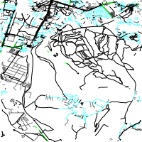
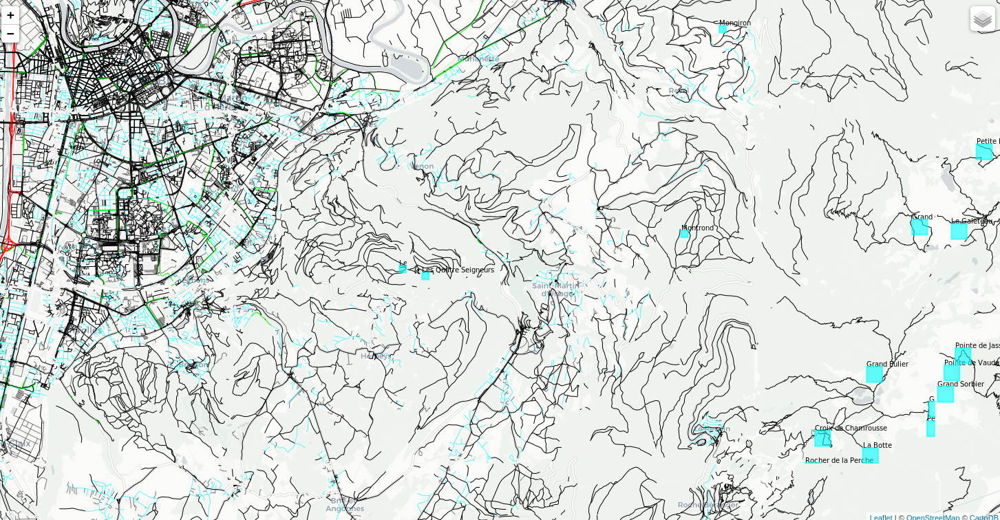

# MS BigData - Stockage et traitement de données à grande échelle

## Introduction aux Systèmes d'Information Géographiques – TP OpenStreetMap -partie II python

Cécile Boukamel-Donnou
__________________

Vous trouverez ci-dessous mes réponses Au TP OpenStreetMap partie II python ainsi que le code et les résultats obtenus.

## Fonctionnalités in fine

Cette application permet de:

* récupérer les noms et coordonnées géographiques des points dont le nom ressemble à (au sens du LIKE SQL) l'argument saisit.

* lancer un serveur de tuile, avec ou sans cache qui sert des couches contenant les routes et les sommets sur un fond de carte.

## Architecture

Un fichier Makefile permet de rapidement créer l'environnement virtuel python avec les librairies nécessaire, jouer les réponses aux questions, lancer les serveurs

### Coté serveur

Un serveur WEB qui peut être lancé en deux modes différents : avec ou sans cache.  
Si le serveur est lancé sans cache, il interroge la classe **Tile** qui crée une tuile de la taille demandée, contenant les informations de la couche désirée,
à partir des donnés comprises dans la "boite" passée en paramètre et exprimées en srid.

Si le serveur est lancé en mode cache, il interroge la classe **Cache**. Celle-ci cherche dans son cache (répertoire contenant les images) la tuile correspondante à la demande (même boite, couche, srid, taille de tuile), si la tuile existe, elle est renvoyée, sinon elle est demandée à la classe **Tile** comme le ferait le serveur sans cache, puis enregistrée dans le cache avant des renvoyée.

### Coté client

Une page HTML instancie un contenu fourni par le script map.js  
Le script map.js utilise l'api leaflet pour demander et afficher des tuiles de chaque couche de manière optimisée.

## Installation

Pour installer et créer l'environnement permettant d'exécuter les scripts du tp:

```shell
sudo apt install libcairo2-dev pkg-config python3-dev
git clone https://github.com/cecileDo/tpGIS.git
cd tpGIS
make venv
source venv/bin/activate
make dependencies
```

## Réponses aux questions du tp

Toutes les commandes décrites ci-dessous sont lancées dans l'environnement virtuel installé précédemment.

### Interrogation de la base de données avec psycopg2 et posgis

>Question 10 : Écrivez un petit programme de test prenant un argument en ligne de commande, et affichant tous les noms et coordonnées géographiques des points dont le nom ressemble à (au sens du LIKE SQL) l'argument.

Le programme est disponible dans le fichier python osm/server/get_like_node.py

```shell
make get_nodes 
Enter search regexp:Dom__ne _niversit%
Mes params <connection object at 0x7f8ec9bbb048; dsn: 'user=boukamec password=xxx dbname=osm host=195.221.228.252', closed: 0>, select tags->'name', ST_x(geom), ST_y(geom) from nodes where tags->'name' like %s;, ('Dom__ne _niversit%',) 

('Domaine Universitaire', 5.7588187, 45.1935807)
('Domaine Universitaire', 5.758102, 45.1874865)
('Domaine Universitaire', 5.7569834, 45.1870508)
('Domaine Universitaire', 5.7695911, 45.1881104)
('Domaine Universitaire', 5.7611708, 45.1898362)
(venv) cecile@cecile-VirtualBox:~/masterBD/tpGIS/python-osm$ 
```

### Création d'une tuile

> Question 11 : Écrivez la fonction demandée, ainsi qu'un petit programme qui la teste sur la boîte englobante de longitudes comprises entre 5.7 et 5.8, et latitudes comprises entre 45.1 et 45.2, dans le système WGS84.

Le programme est disponible dans osm/server/tile.py.

Un exemple de résultat peut-être obtenu par :

```shell
   make get_highway_example
```

Image générée :  



**Remarque sur la conception de la requête Tile.get_highway():**  
Pour faire la sélection  des chemins, c'est l'enveloppe, construite avec les paramètres x_min y_min, x_max, y_max, qui est transformée en coordonnées 4326 correspondant a celle de la géométrie des ways dans la base de données, et non l'inverse. Je ne savais pas quelle solution est la plus optimisée.

### serveur de tuile

>Question 12 : Complétez le fichier WMSServer.py pour implanter le serveur WMS tel que décrit ci-dessus.

Pour lancer le serveur:

```shell
   make run_WMS
```

Le code est disponible dans osm/server/WMSserver.py.  
Le handler du server test les paramètres de la requête, retourne une erreur si ils ne sont pas correctes, dans le cas contraire, la methode tile.get_tile() est appelée avec les paramètres de la requête.

Le test des paramètres est vérifié en lançant le fichier tests/test_WMSserver.sh dont le résultat est fournit en annexe.

### serveur de tuile avec cache

Pour lancer le serveur:

```shell
   make run_WMS_cached
```

Le code est disponible dans osm/server/cache.py.
Un fichier de test est disponible sous test/test_cache.py, il test la méthode de creation des noms de fichier.

**Remarque sur la conception du cache:**  
Chaque image générée est sauvegardée dans le répetoire osm/server/\_\_cache\_\_.  
Ce répertoire contient deux sous répertoires "peaks" et "roads" correspondant aux couches.  

les noms de fichiers sont ensuite construits de la manière suivante:  
{x_min}_{y_min}_{x_max}_{y_max}_{srid}_{width}_{height}.PNG  
  dans lequel les '.' sont remplacés par des '-'.  
Par exemple:  
621280-1659019126_5635549-221409476_626172-1357121639_5640441-191219728_3857_256_256.PNG

### Ajout d'une nouvelle couche

>Question 15 : Créez d'autres couches (que vous pouvez rendre accessible également par le biais de votre serveur WMS) et ajoutez-les à votre client Leaflet. Quelques suggestions : ensemble des bâtiments, hydrographie (rivières, etc.), ensemble des pistes de ski autour de Grenoble, etc.

Pour cet exercice, j'ai choisi de représenter les sommets, avec un rectangle plus ou moins gros selon l'altitude.
Leurs noms sont aussi affichés.  

Le script osm/client/map.js a été modifié pour afficher une nouvelle couche qui n'est pas activée pas défaut.
Une nouvelle méthode get_peaks() est ajoutée au serveur de tuile et appelée lorsque la couche demandée est "peaks".

Pour activer la couche dans le navigateur cocher la couche sommets:



**Remarques sur la réalisation:**  

* Certaines couleurs n'ont pas pu être utilisées (orange par exemple), car elles ne fonctionnent pas, je n'ai pas compris pourquoi.

* Les noms des sommets se chevauchent parfois, il aurait fallu utiliser une autre méthode pour les représenter ( Gliph ?)

* La méthode drawer.draw_rectangle() contenait une coquille dans les noms des paramètres ( x1, y1 au lieux de width, heigth) elle a été modifiée.

### Annexe résultat test d'erreur du serveur

Tests effectués (aussi par le navigateur mais c'est plus facile a montrer ici):

```sh
(venv) cecile@cecile-VirtualBox:~/masterBD/tpGIS/python-osm/tests$ ./test_WMSserver.sh 
<!DOCTYPE HTML PUBLIC "-//W3C//DTD HTML 4.01//EN"
        "http://www.w3.org/TR/html4/strict.dtd">
<html>
    <head>
        <meta http-equiv="Content-Type" content="text/html;charset=utf-8">
        <title>Error response</title>
    </head>
    <body>
        <h1>Error response</h1>
        <p>Error code: 422</p>
        <p>Message: Parametre obligatoire manquant : request.</p>
        <p>Error code explanation: 422 - .</p>
    </body>
</html>
<!DOCTYPE HTML PUBLIC "-//W3C//DTD HTML 4.01//EN"
        "http://www.w3.org/TR/html4/strict.dtd">
<html>
    <head>
        <meta http-equiv="Content-Type" content="text/html;charset=utf-8">
        <title>Error response</title>
    </head>
    <body>
        <h1>Error response</h1>
        <p>Error code: 422</p>
        <p>Message: Parametre obligatoire manquant : layers.</p>
        <p>Error code explanation: 422 - .</p>
    </body>
</html>
<!DOCTYPE HTML PUBLIC "-//W3C//DTD HTML 4.01//EN"
        "http://www.w3.org/TR/html4/strict.dtd">
<html>
    <head>
        <meta http-equiv="Content-Type" content="text/html;charset=utf-8">
        <title>Error response</title>
    </head>
    <body>
        <h1>Error response</h1>
        <p>Error code: 422</p>
        <p>Message: Parametre obligatoire manquant : height.</p>
        <p>Error code explanation: 422 - .</p>
    </body>
</html>
<!DOCTYPE HTML PUBLIC "-//W3C//DTD HTML 4.01//EN"
        "http://www.w3.org/TR/html4/strict.dtd">
<html>
    <head>
        <meta http-equiv="Content-Type" content="text/html;charset=utf-8">
        <title>Error response</title>
    </head>
    <body>
        <h1>Error response</h1>
        <p>Error code: 422</p>
        <p>Message: Parametre obligatoire manquant : width.</p>
        <p>Error code explanation: 422 - .</p>
    </body>
</html>
<!DOCTYPE HTML PUBLIC "-//W3C//DTD HTML 4.01//EN"
        "http://www.w3.org/TR/html4/strict.dtd">
<html>
    <head>
        <meta http-equiv="Content-Type" content="text/html;charset=utf-8">
        <title>Error response</title>
    </head>
    <body>
        <h1>Error response</h1>
        <p>Error code: 422</p>
        <p>Message: Parametre obligatoire manquant : srs.</p>
        <p>Error code explanation: 422 - .</p>
    </body>
</html>
<!DOCTYPE HTML PUBLIC "-//W3C//DTD HTML 4.01//EN"
        "http://www.w3.org/TR/html4/strict.dtd">
<html>
    <head>
        <meta http-equiv="Content-Type" content="text/html;charset=utf-8">
        <title>Error response</title>
    </head>
    <body>
        <h1>Error response</h1>
        <p>Error code: 422</p>
        <p>Message: Parametre obligatoire manquant : bbox.</p>
        <p>Error code explanation: 422 - .</p>
    </body>
</html>
<!DOCTYPE HTML PUBLIC "-//W3C//DTD HTML 4.01//EN"
        "http://www.w3.org/TR/html4/strict.dtd">
<html>
    <head>
        <meta http-equiv="Content-Type" content="text/html;charset=utf-8">
        <title>Error response</title>
    </head>
    <body>
        <h1>Error response</h1>
        <p>Error code: 404</p>
        <p>Message: Erreur mauvaise requête reçue: toto. La seule requête acceptée est GetMap.</p>
        <p>Error code explanation: 404 - Nothing matches the given URI.</p>
    </body>
</html>
<!DOCTYPE HTML PUBLIC "-//W3C//DTD HTML 4.01//EN"
        "http://www.w3.org/TR/html4/strict.dtd">
<html>
    <head>
        <meta http-equiv="Content-Type" content="text/html;charset=utf-8">
        <title>Error response</title>
    </head>
    <body>
        <h1>Error response</h1>
        <p>Error code: 422</p>
        <p>Message: Parametre layers doit etre soit roads soit peaks : rr.</p>
        <p>Error code explanation: 422 - .</p>
    </body>
</html>
Warning: Binary output can mess up your terminal. Use "--output -" to tell 
Warning: curl to output it to your terminal anyway, or consider "--output 
Warning: <FILE>" to save to a file.
<!DOCTYPE HTML PUBLIC "-//W3C//DTD HTML 4.01//EN"
        "http://www.w3.org/TR/html4/strict.dtd">
<html>
    <head>
        <meta http-equiv="Content-Type" content="text/html;charset=utf-8">
        <title>Error response</title>
    </head>
    <body>
        <h1>Error response</h1>
        <p>Error code: 400</p>
        <p>Message: Bad request syntax ('GET /wms?request=GetMap&amp;layers=roads&amp;height=20&amp;width=30&amp;srs=EPSG:3857&amp;bbox=645740.014953169,5650225.13084023,650631.9847634204,5655117.100650479 --output toto.PNG HTTP/1.1').</p>
        <p>Error code explanation: HTTPStatus.BAD_REQUEST - Bad request syntax or unsupported method.</p>
    </body>
</html>
```
